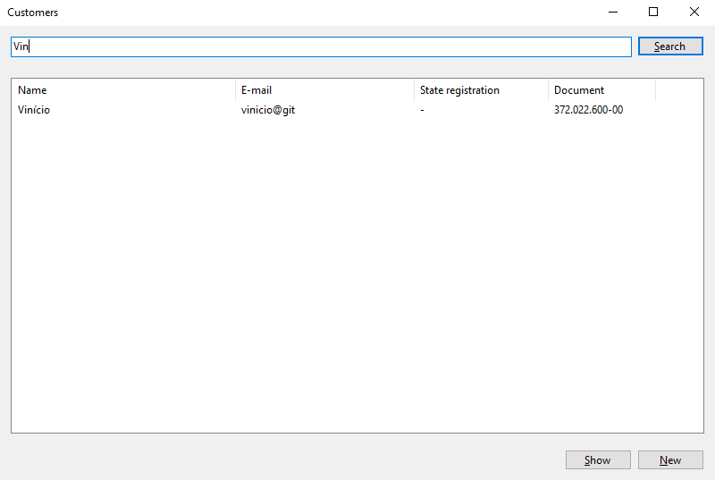
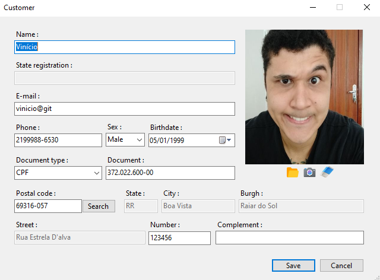

# CustomerCadaster

This is a desktop application developed with C# using Windows Forms, Entity Framework, .Net Core 3.1 and SQL Server 18.8.

# Overview

This application is a CRUD to manage customers data.

# How to start

* Clone

    Clone this repository.

* Connection string

    Create a appSettings.json file within the Cadaster.UI project and paste the code below replacingo with your data.    
   
   > {        
   > 	 "ConnectionStrings": { "DbConn": "Server=\<SERVER\>;Database=CustomerCadaster;User=\<USER\>;Password=\<Password\>;" }    
   > }    
	    
* Database
    
    Now that the connection string is properly defined, open the command line tool, access the solution folder and run the database update.
    
    > dotnet ef database update -p Cadaster.UI/Cadaster.UI.csproj    
    
# Usage

The application allows to list customers filtering by its document and/or name.    
The image below shows the listage form.
 

    

To create a new customer, click the New button or right click in the listview and choose New.    
 To delete a customer, select him/her at the listview, right click and select Delete option. Will be displayed a box asking for confirmation, then confirm or cancel the delete action.    
 To show users details, select the row in the listview and click the Show button or right click in the selected row and choose Show. Then, the customer details will be displayed for you to update or simply see more info as shown below.
 

     

# EMGU

The application allows to capture user image using the device's camera. To do this job, the application use the [EMGU](https://www.emgu.com/) library.
